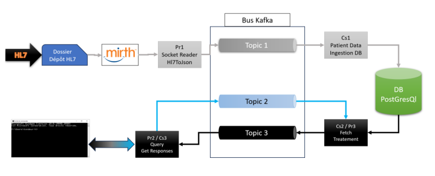

# TP-Inergiciel-FISA4

## Introduction
This class project aim to implement the following architecture : 


The final point is to be able to enter command lines in a console that will give us the informations we want.

## Technologies
- Docker
- Docker-compose
- Java 17
- Maven
- Kafka
- Zookeeper
- PostgreSQL

## Initial Setup
- Clone the project
- Import the channel mirth named "HL7 Conversion.xml" in mirth connect (at the root of the project)
- Run the following command to start the project
```git bash
sh build_and_deploy.sh
```
Once the project is running, you can use the following commands to run the console and send commands : 
```git bash
docker attach appconsole
```

## Docker Containers
We have 8 container running :
- 'brocker' -> The Broker container
- 'zookeeper' -> The Zookeper container
- 'mirth450'-> The Mirth Connect container
- 'mcdb' -> The Database container with the PostgreSQL database
- 'api' -> A container running the API that receive the json from mirth (Producer Pr1 in the schema above)
- 'dbingest' -> A container that uses the json to put data in the database (consumer Cs1 in the schema above)
- 'appconsole' -> A container running the console that will allow us to send commands and display answers (Producer Pr2 and Consumer Cs3 in the schema above)
- 'fetchtrat' -> A container that will fetch data from the database and send it to the console (Consumer Cs2 Producer Pr3 in the schema above)

## App
The app is a simple console that will allow us to send commands transform the command in SQL to ask the database and then display the result.
To do that we first have loads of files with the extension HL7 (extension for health level 7). Mirth then convert those files into JSON through the channel "HL7 Conversion.xml". This Json is sent to the API that will transfert them to dbinges throught a kafka bus. dbingest tranform the Json into SQL and send it to the database.
On the other side, there is two applications that are producers and consumers in the same time allowing transfer of information between the console and the database. Therefore, the command written by the user will be transformed into a SQL command to have to correct result of the database and then display it.

### The different commands
- get_all_patients (return all the patients and their information)
- get_patient_by_pid (return the complete identity of the patient thanks to their id PID-3)
- get_patient_by_name (return the complete identity of the patient thanks to one of their name)
- get_patient_stay_by_pid (return the stays of a patient thanks to their id PID-3)
- get_patient_movements_by_sid (return all the movements of a patient through their stay id)
- export (Export the data of a patient in a json thanks to their id PID-3)
- help (Display the list of commands and their description given above)
- exit (Close the app)

## Team
[Léo Wadin](https://github.com/ArKc0s)<br>
[Elena Beylat](https://github.com/PetitCheveu)<br>
[Aurélien Houdart](https://github.com/Zaykiri)<br>

